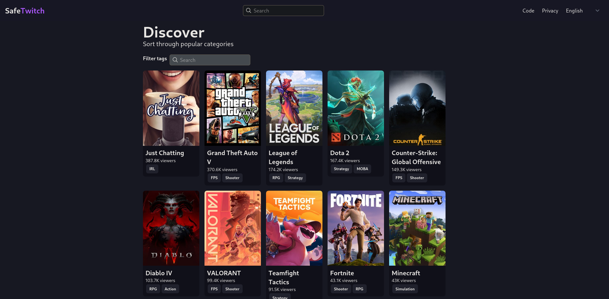

# SafeTwitch

SafeTwitch is a privacy respecting frontend for [twitch.tv](https://twitch.tv/)

The main advantages of SafeTwitch are:

- Private: Every request is proxied through the server, and no logs are kept.
- Lightweight: Compared to twitch, SafeTwitch is optimized for speed and usability.

 

You can find an instance to use [here](#instances)!

Do you want to help translate? You can do it over here on weblate! [Translate](#translate)

# Okay, but why?

It is impossible to use Twitch without being bombarded with tons of ads, multiple trackers, and enourmous page sizes and loading times. This project aims to fix these issues, by removing all trackers, have much smaller page sizes, and very fast loading times.

# Features

### User features

- [x] No connection to twitch/amazon
- [x] Lightweight on server and client
- [x] No Ads or tracking
- [x] No outside connections, only connection is the instance
- [x] Uses [Vue](https://vuejs.org/) for a speedy experience
- [x] No logs
- [x] Much smaller pages compared to Twitch (<1.6mb with images compared to >8.2mb)
- [x] Follow streamers locally to have a more personalized feel
- [x] Infinite scrolling
- [x] Proxied WebSocket IRC

### Technical features

- [x] Public API
- [x] No official APIs are used
- [x] No rate limiting
- [x] Uses a custom Twitch webscraper

It's not all sunshine and rainbows though, and still has various cons, including

- SafeTwitch was a learning project
- Uses Vue, which relies on Javascript

You aren't forced to use SafeTwitch, so use whatever suits you the most!
Heres some other notable twitch projects

- [Xtra](https://f-droid.org/packages/com.github.andreyasadchy.xtra/), a Twitch client focused on providing the best viewing and chatting experience on mobile devices
- [Twire](https://f-droid.org/packages/com.perflyst.twire/), an ad free Twitch browser and stream player for Android.
- [Streamlink Twitch Gui](https://streamlink.github.io/streamlink-twitch-gui/), A multi platform Twitch.tv browser for Streamlink
- [Twineo](https://codeberg.org/CloudyyUw/twineo), A alternative twitch frontend

# Screenshots

| Images                                              | More Images                                         |
| --------------------------------------------------- | --------------------------------------------------- |
|        |      |
|  |  |
# Donations

Donations towards development are not accepted. I really thank you for feeling the need to donate, it does mean a lot to me!

Instead, please donate your money to one of these charities which mean a lot to me.

- [American Foundation for Suicide Prevention](https://afsp.org/)
- [Boys and Girls Club of America](https://www.bgca.org/ways-to-give)

# Getting Started

All documentation can be found on the [wiki](https://codeberg.org/SafeTwitch/safetwitch/wiki)

## Translate

Translating is a great way to help contribute! Even if it's only one word, anything helps!

You can translate here: https://translate.codeberg.org/projects/safetwitch/frontend/

## Instances

If you host a SafeTwitch instance and would like it to be listed in the readme, please make an issue or a pull request to add it in.

### Clearnet

| URL                                                                         | Country        | Info                                                                                               | Cloudflare |
|-----------------------------------------------------------------------------|----------------|----------------------------------------------------------------------------------------------------| ---------- |
| [safetwitch.drgns.space \(Official\)](https://safetwitch.drgns.space/)      | 🇺🇸             | Homelab                                                                                            | ❌         |
| [safetwitch.projectsegfau.lt](https://safetwitch.projectsegfau.lt/)         | 🇺🇸 🇮🇳 🇩🇪       | #2                                                                                                 | ❌         |
| [stream.whateveritworks.org](https://stream.whateveritworks.org)            | 🇩🇪             | Hosted on Hetzner/Dedicated Server with Encryption at rest                                         | ✅         |
| [safetwitch.datura.network](https://safetwitch.datura.network)              | 🇩🇪             | #9                                                                                                 | ❌         |
| [ttv.vern.cc](https://ttv.vern.cc)                                          | 🇺🇸             | #12                                                                                                | ❌         |
| [safetwitch.frontendfriendly.xyz](https://safetwitch.frontendfriendly.xyz/) | 🇺🇸             | #16                                                                                                | ❌         |
| [ttv.femboy.band](https://ttv.femboy.band)                                  | 🇩🇪             | #29                                                                                                | ❌         |
| [twitch.seitan-ayoub.lol](https://twitch.seitan-ayoub.lol)                  | 🇩🇪             | Hetnzer VPS                                                                                        | ❌         |
| [st.ggtyler.dev](https://st.ggtyler.dev)                                    | 🇺🇸             | [See ggtyler's frontend list for more info and locations](https://www.ggtyler.dev/other/frontends) | ❌         |
| [safetwitch.lunar.icu](https://safetwitch.lunar.icu)                        | 🇩🇪             | [See lunar.icu's site for more info](https://lunar.icu)                                            | ❌         |
| [twitch.sudovanilla.org](https://twitch.sudovanilla.org)                    | 🇺🇸             | Selfhosted                                                                                         | ❌         |
| [safetwitch.r4fo.com](https://safetwitch.r4fo.com)                          | 🇩🇪             | #80                                                                                                | ✅         |
| [safetwitch.ducks.party](https://safetwitch.ducks.party)                    | 🇳🇱             | Timeweb VPS                                                                                        | ❌         |
| [safetwitch.nogafam.fr](https://safetwitch.nogafam.fr)                      | 🇫🇷             | [See NoGafam services](https://nogafam.fr)                                                         | ❌         |
| [safetwitch.privacyredirect.com](https://safetwitch.privacyredirect.com/)   | 🇫🇮             | #98                                                                                                | ❌         |
| [st.ngn.tf](https://st.ngn.tf/)                                             | 🇹🇷             | Selfhosted                                                                                         | ❌         |
| [safetwitch.darkness.services](https://safetwitch.darkness.services)        | 🇺🇸             | #119                                                                                               | ✅         |
| [safetwitch.4o1x5.dev/](https://safetwitch.4o1x5.dev/)                      | 🇭🇺             | [See 4o1x5's site for more info](https://4o1x5.dev/privacy-policy/)                                 | ❌         | 
| [safetwitch.adminforge.de](https://safetwitch.adminforge.de)                          | 🇩🇪             | Hosted on Hetzner by adminForge.de                                                                                                | ❌         |

### Onion

| URL                                                                                        | Country | Info |
| ------------------------------------------------------------------------------------------ | ------- | ---- |
| [Onion vern.cc](http://ttv.vernccvbvyi5qhfzyqengccj7lkove6bjot2xhh5kajhwvidqafczrad.onion) | 🇺🇸      | #12  |

### I2P

| URL                                                                                | Country | Info |
| ---------------------------------------------------------------------------------- | ------- | ---- |
| [i2p vern.cc](http://vernz43kgqiy3nzzof3nejeo4hh3bjgyqi3b3hijchilv7noqtrq.b32.i2p) | 🇺🇸      | #12  |
